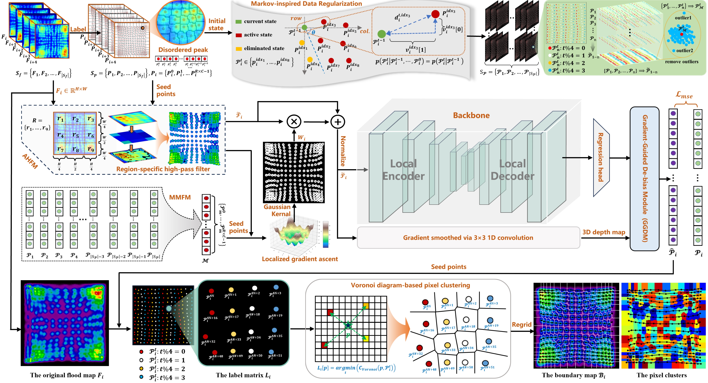

# PETCalibrator: Geometric Consistency-Guided De-bias Learning for Precise Image-Based PET Detector Calibration

[](https://opensource.org/licenses/MIT)
[](https://www.python.org/downloads/)
[](https://pytorch.org/)

This repository contains the official implementation of **PETCalibrator**, a geometric consistency-guided de-bias learning framework designed for precise and efficient image-based Positron Emission Tomography (PET) detector calibration.

> **News:** Our paper has been submitted to *Medical Image Analysis*.

---

## 📖 Introduction

Calibration of PET detectors is critical for ensuring high-quality clinical imaging. Unlike traditional semi-automated software calibration workflows that heavily rely on manual refinement, fully automated image-based methods have become increasingly favored due to their superior adaptability and efficiency. 

However, precise signal peak localization within visually complex and inherently noisy flood maps remains a persistent challenge. **PETCalibrator** addresses these issues by actively correcting continuous spatial label biases without discarding valuable topological data, explicitly leveraging the geometric consistency of the physical crystal array.

## ⚙️ Framework Overview


*(Please place your `overview.png` here. The image should illustrate the three main stages of the proposed pipeline.)*

The pipeline consists of three primary stages:
1. **Markov-inspired Data Regularization:** Transforms inherently disordered and noisy label sequences into a topologically ordered structure to ensure dataset learnability.
2. **Geometric Consistency-Guided Peak Localization:** Leverages the **Gradient-Guided De-biasing Module (GGDM)** to actively correct continuous spatial label biases.
3. **Pixel-wise Image Regridding:** Utilizes an efficient Voronoi diagram-based linear clustering strategy to establish accurate correspondences between pixel-level responses and crystal-level channels, generating the refined Look-Up Table (LUT).


*(Please place your `GGDM.png` here to illustrate the 3D topographic surface and the gradient-guided shift process.)*


*(Please place your `GGDM.png` here to illustrate the 3D topographic surface and the gradient-guided shift process.)*

## 🛠️ Installation

### Prerequisites
- Linux or macOS
- Python 3.8+
- NVIDIA GPU + CUDA CuDNN

### Environment Setup
Clone the repository and install the dependencies:
```bash
git clone [https://github.com/Haitao-Lee/PET_calibration.git](https://github.com/Haitao-Lee/PET_calibration.git)
cd PET_calibration

# Create a virtual environment (optional but recommended)
conda create -n petcalib python=3.8 -y
conda activate petcalib

# Install required packages
pip install -r requirements.txt
