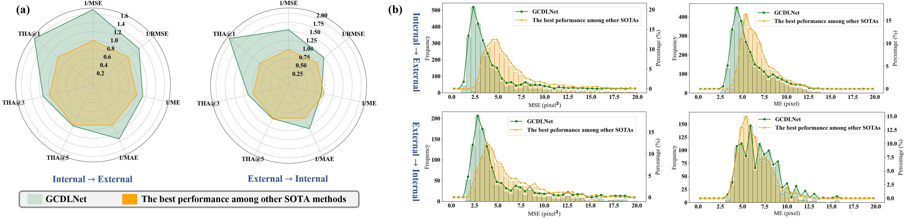

# PETCalibrator: Geometric Consistency-Guided De-bias Learning for Precise Image-Based PET Detector Calibration

[](https://opensource.org/licenses/MIT)
[](https://www.python.org/downloads/)
[](https://pytorch.org/)

This repository contains the official PyTorch implementation of **PETCalibrator** (and its core network **GCDLNet**), a geometric consistency-guided de-bias learning framework designed for precise and efficient image-based Positron Emission Tomography (PET) detector calibration.

> **News:** Our paper has been submitted to *Medical Image Analysis* (2026).

---

## 📖 Introduction

Calibration of PET detectors is critical for ensuring high-quality clinical imaging. Compared to traditional semi-automated software calibration workflows that heavily rely on manual refinement, fully automated image-based methods have become increasingly favored due to their superior adaptability and efficiency.

However, accurate signal peak localization in visually complex and inherently noisy flood maps remains a persistent challenge. Severe signal aliasing and continuous spatial label bias can significantly degrade calibration reliability.

**PETCalibrator explicitly addresses this problem by correcting continuous spatial label bias while preserving the intrinsic geometric consistency of the physical crystal array.**

---

## ⚙️ Framework Overview


The proposed pipeline consists of three major stages:

### 1️⃣ Markov-inspired Data Regularization  
Transforms inherently disordered and noisy peak label sequences into a topologically ordered structure, improving dataset learnability while preserving structural priors.

### 2️⃣ Geometric Consistency-Guided Peak Localization (GCDLNet)
Introduces the **Gradient-Guided De-biasing Module (GGDM)**, which actively shifts biased peak predictions along the underlying topographic gradient field to correct continuous spatial deviation. It also utilizes **AHFM** (Adaptive High-Pass Filter Module) and **MMFM** (Mean Model Fusion Module) for robust feature extraction.


### 3️⃣ Pixel-wise Image Regridding  
Applies a Voronoi diagram-based linear clustering strategy to establish accurate correspondences between pixel-level responses and crystal-level channels, generating the refined Look-Up Table (LUT).

---

## 📂 Repository Structure

```text
PET_calibration/
├── models/
│   ├── GCDLNet.py       # Core network (includes AHFM, MMFM, GGDM)
│   └── mean_model.pth   # Pre-computed mean topological prior model
├── static/              # Images for README
├── configs/             # Hyperparameter configurations (config.py)
├── data_set.py          # Custom PyTorch Dataset for loading flood maps
├── train.py             # Main training script with Early Stopping
├── infer.py             # Inference script for visualization and LUT prep
├── environment.yml      # Conda environment dependencies
└── README.md
```

---

## 📦 Dataset Preparation

The network requires paired grayscale PET flood maps and their corresponding biased initial peak coordinates. Both images and labels should be saved in `.npy` format.

Please organize your dataset directory as follows:
```text
dataset/
├── train/
│   ├── images/          # .npy flood map arrays (e.g., 256x256)
│   └── labels/          # .npy coordinate arrays (e.g., 256x2)
├── val/
└── test/
```
*Note: Modify the data paths in your configuration files to point to these directories before training.*

---

## 🛠 Installation

### Prerequisites
- Linux or macOS  
- Python 3.8+  
- NVIDIA GPU with CUDA and cuDNN  

### Environment Setup
We provide an `environment.yml` file for effortless reproducibility (exported without builds for cross-platform compatibility). Clone the repository and build the conda environment:

```bash
git clone [https://github.com/Haitao-Lee/PET_calibration.git](https://github.com/Haitao-Lee/PET_calibration.git)
cd PET_calibration

# Create and activate the conda environment
conda env create -f environment.yml
conda activate petcalib
```

---

## 🚀 Training

To train the **GCDLNet** model from scratch, run:

```bash
python train.py
```
- The training script automatically utilizes `tqdm` for progress tracking.
- Metrics and loss curves are saved to `models/GCDLNet.log` and `./loss/Loss.png`.
- The script employs an **EarlyStopping** mechanism, saving the optimal weights to `models/GCDLNet_best.pth`.

---

## 🔍 Inference & Evaluation

To evaluate the trained model on test flood maps and generate visualized peak localizations, run the inference script:

```bash
python infer.py \
    --input_dir ./data/test/images \
    --output_dir ./inference_results \
    --model_weights ./models/GCDLNet_best.pth \
    --mean_model ./models/mean_model.pth \
    --device cuda
```
Predicted peak coordinates will be saved as `.npy` files in `inference_results/coordinates/`, and the visual comparisons will be rendered in `inference_results/visualizations/`.

---

## 📊 Comparison Methods & Fair Protocol

To rigorously evaluate the superiority of PETCalibrator in signal peak localization, we conduct extensive comparisons against recent state-of-the-art architectures, including:
- **CNNs:** ConvNeXtV2, nnUNet, UNet3Plus, ConDSeg, SCTNet
- **Transformers:** ViT, SwinV2, nnFormer, iTPN, TransUNet, UNETR++
- **Mamba-based:** Vision Mamba, VMamba, MobileMamba, SegMamba, UMamba, SparX

### ⚖️ Fair Comparison Protocol
To ensure strict fairness:
- All models are trained under identical experimental settings.
- Each architecture is used strictly as a backbone feature extractor.
- A unified linear regression head is appended for peak coordinate prediction.
- Training schedules, optimizers, and data splits are fully consistent.

### 📈 Experimental Results
Extensive experiments demonstrate that PETCalibrator consistently achieves superior localization accuracy and improved structural consistency compared with strong CNN, Transformer, and Mamba baselines.

**Quantitative Comparison:**


**Qualitative Comparison:**


---

## 📌 Citation

If you find this code or our conceptual framework useful for your research, please consider citing our paper:

```bibtex
@article{li2026petcalibrator,
  title={PETCalibrator: Geometric Consistency-Guided De-bias Learning for Precise Image-Based Positron Emission Tomography Detector Calibration},
  author={Li, Haitao and Liu, Weiping and Xu, Jiangchang and Wang, Zhelong and Chen, Xiaojun},
  journal={Medical Image Analysis},
  year={2026},
  publisher={Elsevier},
  note={Under review}
}
```

---

## 📧 Contact

For any questions or discussions regarding the implementation, please open an issue or contact the authors.

## 📄 License

This project is released under the [MIT License](LICENSE).
