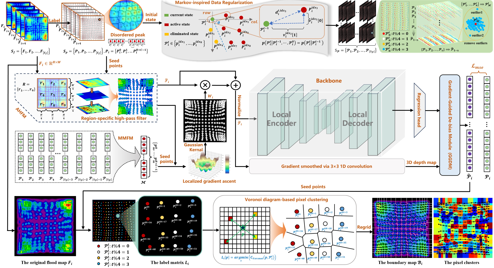
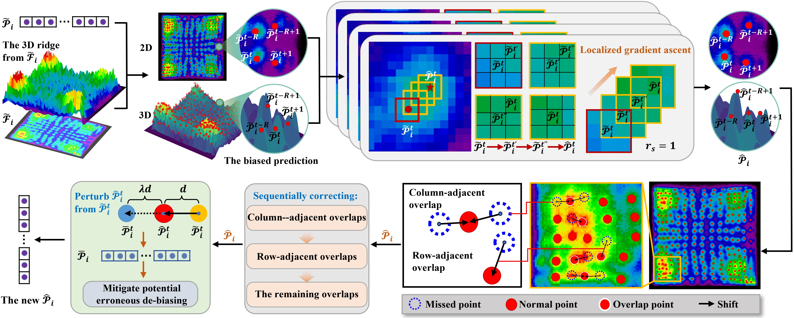
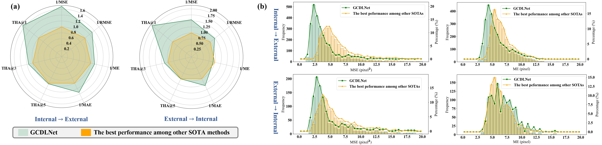

# PETCalibrator: Geometric Context Fusion De-bias Learning for Resilient Image-Based PET Detector Calibration

[](https://opensource.org/licenses/MIT)
[](https://www.python.org/downloads/)
[](https://pytorch.org/)

Official PyTorch implementation of **PETCalibrator** and its core network **DeLocNet**, a geometric context fusion de-bias learning framework for precise and efficient image-based Positron Emission Tomography (PET) detector calibration.

> **News:** Our paper has been submitted to *Information Fusion* (Elsevier, 2026).
> The earlier preprint version of this codebase corresponded to a *Medical Image Analysis* submission; the current code matches the *Information Fusion* manuscript.

---

## 📖 Introduction

Calibration of PET detectors is critical for ensuring high-quality clinical imaging. Compared to traditional semi-automated software workflows that heavily rely on manual refinement, fully automated image-based methods have become increasingly favored due to their superior adaptability and efficiency.

Accurate signal peak localization in visually complex flood maps, however, remains a persistent challenge. Severe signal aliasing and continuous spatial label bias — typically 3–5 pixel deviations introduced by the manual annotation workflow — can significantly degrade calibration reliability. Existing de-bias learning paradigms treat individual training samples as independent entities, overlooking the inherent geometric context consistency of flood maps.

**PETCalibrator explicitly addresses this problem by correcting continuous spatial label bias while preserving the geometric context consistency of the physical crystal array.** The framework is composed of three stages:

1. **Markov-inspired Data Regularization** — transforms inherently disordered and noisy peak label sequences into a topologically ordered structure, improving dataset learnability while preserving structural priors.
2. **Geometric Context-Guided Peak Localization (DeLocNet)** — a backbone-regression network augmented with three task-specific modules:
   - **GGDM (Gradient-Guided De-bias Module)** iteratively aligns biased predictions with the underlying topographic gradient field, then enforces a spatial consistency-guided criterion to suppress over-corrections.
   - **MMFM (Mean Model Fusion Module)** builds a pre-computed mean peak map across the entire training set and uses it as both a stable spatial initialisation and a heatmap-based spatial prior.
   - **AHFM (Adaptive High-Pass Filtering Module)** sharpens ambiguous boundaries in flood maps through a partitioned adaptive filtering mechanism.
3. **Pixel-wise Image Regridding** — applies a Voronoi diagram-based linear clustering strategy to establish accurate correspondences between pixel-level responses and crystal-level channels, generating the refined Look-Up Table (LUT).

---

## 🖼️ Framework Overview



The proposed pipeline consists of the three stages above.

### Gradient-Guided De-bias Module (GGDM)



GGDM interprets the 2D grayscale flood map as a 3D ridge surface, treats each initial peak as a point on that surface, and runs a localized gradient-ascent refinement within a fixed search radius (`r_s = 2 px`). A spatial consistency-guided criterion with a perturbation parameter (`λ = 0.6`, threshold `ξ_d = 4`) further rejects erroneous shifts that would otherwise increase the mean squared error.

---

## 📂 Repository Structure

```text
PET_calibration/
├── ckpts/                # Trained weights go here (DeLocNet_best.pth, mean_model.pth)
├── models/
│   ├── DeLocNet.py       # Main network (was GCDLNet.py in the previous version)
│   ├── GGDM.py           # Gradient-Guided De-bias Module
│   ├── AHFM.py           # Adaptive High-Pass Filtering Module
│   └── MMFM.py           # Mean Model Fusion Module
├── utils/
│   ├── data_input.py
│   ├── data_preprocess.py
│   ├── data_set.py
│   ├── data_transform.py
│   ├── data_visualization.py
│   ├── initialize.py
│   ├── regridding.py
│   └── Loss.py
├── static/               # Figures used in this README
│   ├── overview.png
│   ├── GGDM.png
│   ├── comparison.png
│   └── reliability.png
├── config.py             # Centralised training/inference configuration
├── train.py              # Main training entry point
├── infer.py              # Inference entry point (predict peaks + render PNGs)
├── environment.txt       # Conda environment (see Installation)
├── LICENSE               # MIT License
└── README.md
```

---

## 📦 Dataset Preparation

The network consumes paired grayscale PET flood maps and their corresponding (biased) initial peak coordinates. Both images and labels are stored as `.npy` files.

Organise your dataset directory as follows:

```text
dataset/
├── train/
│   ├── img/              # 256x256 flood-map arrays (.npy)
│   └── label/            # 256x2 coordinate arrays (.npy)
├── val/
│   ├── img/
│   └── label/
└── test/
    ├── img/
    └── label/
```

`config.py` points to these directories by default; override the `--train_img_dir`, `--train_label_dir`, `--val_img_dir`, `--val_label_dir`, `--test_img_dir`, `--test_label_dir` flags on the command line as needed.

### Building the MMFM mean model

`mean_model.pth` is the pre-computed cross-sample mean of all (Markov-regularised) training labels after DBSCAN outlier removal. Save it once before training with `models.DeLocNet.build_DeLocNet` or by running the preprocessing pipeline in `utils/data_preprocess.py`. By default it lives at `./checkpoints/mean_model.pth`.

---

## 🛠 Installation

### Prerequisites
- Linux or macOS
- Python 3.8+
- NVIDIA GPU with CUDA 11.8 and cuDNN

### Environment Setup

The file `environment.txt` is a Conda environment exported with build strings stripped for cross-platform reproducibility:

```bash
git clone https://github.com/Haitao-Lee/PET_calibration.git
cd PET_calibration

conda create --name petcalib --file environment.txt
conda activate petcalib
```

If you prefer an explicit `environment.yml`, regenerate it locally with:

```bash
conda env export > environment.yml
```

---

## 🚀 Training

Train **DeLocNet** from scratch by running:

```bash
python train.py
```

Behaviour:
- Training progress is rendered with `tqdm`.
- The latest checkpoint is overwritten every epoch to `./checkpoints/DeLocNet_latest.pth`.
- The best checkpoint (lowest validation MSE) is written to `./checkpoints/DeLocNet_best.pth`.
- `EarlyStopping` (default `patience=100`) halts training when validation loss stops improving.
- Loss curves and per-epoch summaries are written to `./models/DeLocNet.log` and `./loss/`.

### Key Hyperparameters (from `config.py`)

| Argument | Default | Meaning |
|---|---|---|
| `--epochs` | 200 | Total training epochs |
| `--patience` | 100 | Early-stopping patience |
| `--lr` | `5e-4` | Adam learning rate |
| `--train_loss` / `--valid_loss` | `nn.MSELoss()` | Loss functions |
| `--save_model` | `./checkpoints` | Checkpoint directory |

The GGDM / MMFM / AHFM hyper-parameters used at inference are baked into the model file (`radius=10`, `filter_rate=1`, `point_distance_threshold=4`, etc.); see `models/DeLocNet.py` for the defaults.

---

## 🔍 Inference

To run DeLocNet on a folder of test flood maps and dump the predicted peak coordinates plus PNG visualisations:

```bash
python infer.py \
    --input_dir ./dataset/test/img \
    --output_dir ./inference_results \
    --model_weights ./checkpoints/DeLocNet_best.pth \
    --mean_model ./checkpoints/mean_model.pth \
    --device cuda
```

Outputs:
- `inference_results/coordinates/<name>_peaks.npy` — predicted `(256, 2)` array of peak coordinates per flood map.
- `inference_results/visualisations/<name>_peaks.png` — flood map with predicted peaks overlaid.
- Pass `--no_visualisation` to skip PNG rendering when you only need the `.npy` outputs.

For batch regridding into a Look-Up Table, use the helpers in `utils/regridding.py` (Voronoi assignment, K-Means, EDT, watershed, etc.). The default Voronoi-based linear clustering runs in ~5 ms per 256×256 patch on a single CPU.

---

## 📊 Experimental Highlights

### Dataset
- 5 PET scanners (uMI 510, Shanghai United Imaging Healthcare Co., Ltd.).
- Each flood map: 1024×1024 = 4×4 sub-maps of 256×256, each sub-map containing a 16×16 = 256-peak crystal-receiver array.
- **7,545 annotated sub-flood maps** in total: 4,025 train, 1,009 internal validation, 2,511 external test.

### Key Results
On the external test set (2,511 samples):
- **MSE = 3.75 ± 2.39 px²**
- **RMSE = 1.87 ± 0.51 px**
- **THA@5 = 98.51%** (peaks with squared error ≤ 5 px²)
- **THA@3 = 90.50%** (squared error ≤ 3 px²)

DeLocNet outperforms 18 strong baselines spanning CNNs (ConvNeXtV2, nnUNet, ConDSeg, UNet3Plus, SCTNet, FocalNet), Transformers (ViT, SwinV2, nnFormer, iTPN, TransUNet, UNETR++), and Mamba-based models (VMamba, VisionMamba, SegMamba, SparX, MobileMamba, UMamba). The full results are summarised in Tables 5–6 of the paper.

### Reliability Study
Trained-on-external → tested-on-internal cross-validation reaches MSE 3.90 ± 2.12 px² with `p < 10⁻⁷⁸` versus the best baseline, confirming the robustness of the proposed de-biasing strategy.

### Qualitative Comparison



### On-device Evaluation
In collaboration with Shanghai United Imaging Healthcare Co., Ltd., PETCalibrator V1 was deployed on a real scanner equipped with a F-18 source rod. The proposed software achieved **95.83% fully-automated success rate** in 51.57 s total, compared to 45.83% (System 1, 2,653.87 s) and 83.33% (System 2, 618.96 s) for the two internal baselines.

---

## 📌 Citation

If you find this code or our conceptual framework useful for your research, please cite the *Information Fusion* version:

```bibtex
@article{li2026petcalibrator_inf,
  title={A Geometric Context Fusion De-bias Learning Framework for Resilient Positron Emission Tomography Detector Calibration},
  author={Li, Haitao and Liu, Weiping and Xu, Jiangchang and Wang, Zhelong and Chen, Xiaojun},
  journal={Information Fusion},
  year={2026},
  publisher={Elsevier},
  note={Under review}
}
```

---

## 📧 Contact

For any questions or discussions regarding the implementation, please open an issue or contact the corresponding author at `xiaojunchen@sjtu.edu.cn`.

## 📄 License

This project is released under the [MIT License](LICENSE).
